# KingST的C51单片机知识点

## Chapter 1 单片机基础知识

### 单片机的内部资源

#### Flash

&emsp;&emsp;**Flash是程序存储空间**，早期单片机是OTPROM。Flash以其可以重复擦写且容量大成本低的优点为现在绝大多数单片机的程序存储器。Flash最大的意义是断电后数据不丢失。

#### RAM

&emsp;&emsp;**RAM是单片机的数据存储空间**，用来存储程序运行过程中产生和需要的数据，跟计算机的内存是相似的概念。RAM的特点是断电后数据丢失。

#### SFR

&emsp;&emsp;**SFR是特殊功能寄存器**，SFR为用户通过对SFR的读写来实现单片机的多种多样的功能。  
&emsp;&emsp;STC89C52是标准的51体系结构，它的资源为Flash程序空间8K字节，RAM数据空间是512字节，SFR特殊功能寄存器为32各IO，3各定时器，1各UART和8各中断。

### 单片机最小系统

单片机最小系统的三要素就是**电源**，**晶振**和**复位电路**

#### 电源

&emsp;&emsp;目前主流单片机的电源分为5V和3.3V两个标准。STC89C52为5V直流电。+5V通常也称为VCC或者VDD，代表电源正极，GND代表电源的负极。（如原理图单片机供电电路）

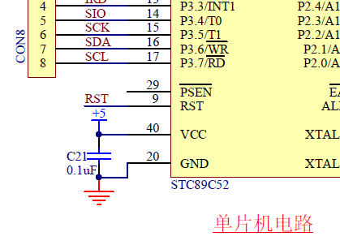

#### 晶振

&emsp;&emsp;**晶振的作用就是为单片机系统提供基准时钟信号。**  
单片机的18引脚和19引脚（如原理图单片机晶振电路）接了一个11.0592MHz的晶振（它每秒振荡11059200次），外加两个20pF的电容， **电容的作用是帮助晶振起振，并维持振荡信号的稳定。**

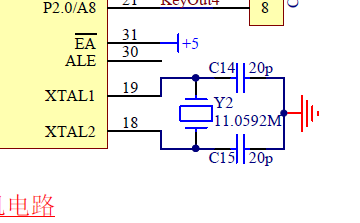

#### 复位电路

&emsp;&emsp;单片机复位一般分为三种情况：上电复位，手动复位和程序自动复位。（如原理图单片机复位电路）

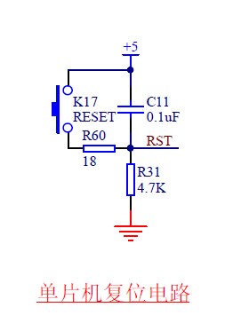

---

## Chapter 2 点亮LED

### LED硬件

#### 发光二极管

&emsp;&emsp;LED即为发光二极管，这种二极管通常的正向导通电压是1.8-2.2V，工作电流一般在1-20mA。  
&emsp;&emsp;其中，当电流在1-5mA之间变化时，随着通过LED的电流越大，灯越亮。  
&emsp;&emsp;而当电流从5-20mA之间变化时，LED亮度变化不大。当电流超过20mA时，LED会有烧坏的风险。

#### 限流电阻

&emsp;&emsp;单片机一般接入VCC的电压是5V，发光二级管的工作自身压降大概是2V，所以就需要电阻来串联分走3V的电压，要求这条路电流范围是1-20mA的话，电阻R的取值范围是150-3kΩ（如原理图USB接口电路的R34为1kΩ），这个电阻直接限制通路的电流大小，因此这个电阻通常称之为 **“限流电阻”**。（图中F1为自恢复保险丝）


### C51特殊语法

#### sfr

&emsp;&emsp;sfr是关键字，它的作用是定义一个单片机特殊功能寄存器，单片机内部有很多寄存器，如果想使用的话必须提前进行声明。

```C
sfr P0 = 0x80;    //查看手册映射(P0,P1,P2,P3,P4)
```

Keil软件已经将这些声明都写好了，所以用的时候文件开头添加一行

```C
#include <reg52.h>  //内含标准51的映射，加强型51的映射需要使用sfr
```

#### sbit

&emsp;&emsp;sbit是关键字，sfr为映射了一个字节，sbit的作用是单独控制一位。

```C
sbit LED = P0^0;    //LED就表示P0.0这一位
```

### LED程序

一般为了防止程序出错，会在程序结尾加入死循环，让程序停在所希望的位置。

```C
while(1);   //程序停止在这里，写在程序的最后
```

最终的点亮程序：

```C
#include <reg52.h>  //包含特殊功能寄存器定义的头文件

sbit LED = P0^0;    //位地址声明

void main()     //主函数入口
{
    LED = 0;    //将LED(P0.0)置为低电平，根据原理图决定LED的亮灭
    while(1);   //死循环，程序停在这里
}
```

或者

```C
#include <reg52.h>  //包含特殊功能寄存器定义的头文件

sbit LED = P0^0;    //位地址声明

void main()     //主函数入口
{
    while(1)    //进入循环
    {
        LED = 0;    //将LED(P0.0)置为低电平，根据原理图决定LED的亮灭
    }
}
```

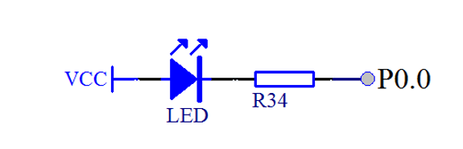

---

## Chapter 3 一些硬件知识

### 硬件知识

#### 去耦电容

※**去耦电容的应用背景**

&emsp;&emsp;由于电磁干扰（EMI），所以需要应用去耦电容。造成电磁干扰的主要有三种形式  
&emsp;&emsp;&emsp;①存在冬天空气干燥造成“静电放电”（ESD）  
&emsp;&emsp;&emsp;②电机设备使用时的干扰造成“快速瞬间群脉冲”（EFT）  
&emsp;&emsp;&emsp;③热插拔造成的“浪涌”（Surge）  
&emsp;&emsp;基于上面的问题，所以诞生了电磁兼容（EMC）。

※**耦电容的应用：大电容低频滤波，小电容高频滤波。**

&emsp;&emsp;大电容（如原理图电源开关电路的C19）的作用为  
&emsp;&emsp;&emsp;①缓冲作用：上电瞬间，让电流缓慢流入电路。  
&emsp;&emsp;&emsp;②稳定作用：后级电路功率大小不一样，所需电流也不一样，可能导致启动有先后，有电容就可以稳定整个电路的电压不会下降太多。  
&emsp;&emsp;大电容的选取：  
&emsp;&emsp;&emsp;第一个参数是耐压值的考虑：一般为系统电压的1.5倍到2倍（一般单片机系统为5V），有些场合可以稍微再高一点。
&emsp;&emsp;&emsp;第二个参数是电容容量的考虑：根据整套系统的功率消耗情况决定，如果系统耗电较大，波动可能比较大，容值就要选大一些的，反之可以小一些。

&emsp;&emsp;小电容（如原理图电源开关电路的C10）的作用为：滤除高频信号的干扰。一般在IC供电的地方都会加上这个小电容，在布线的时候还会考虑尽可能靠近IC。  
&emsp;&emsp;小电容的选取：在电源处的去耦高频电容，直接选用0.1μF（104电容⇒10×10^4pF=100nF=0.1μF）。

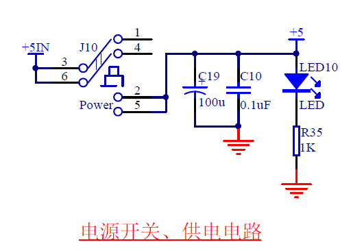

#### 三极管

&emsp;&emsp;三极管是模拟电路和数字电路中经常会用到的一个器件，三极管可分为**PNP型三极管**和**NPN型三极管**。三极管一共有3个极，横向左侧的的引脚叫作**基极b**（base），中间的箭头一头连接基极，一头连接**发射极e**（emitter），剩下一个引脚就是**集电极c**（collector）。


※**三极管的原理**

&emsp;&emsp;三极管的关键点在于b极和e极之间的电压关系。以PNP型为例，e极电压只要高于b极电压0.7V以上，这个三极管的e极和c极之间就是顺利导通的。也可是说控制端在b和e之间，被控制端在b和c之间。如原理图所示，当P1.0处于高电平（5V）的时候，e和b之间无压降，所以三极管e和c之间不导通，LED就不亮；当P1.0处于低电平（0V）的时候，e和b之间有压降且大于0.7V，三极管e和c之间导通，LED就亮。（e和c之间大概会有0.2V的压降）

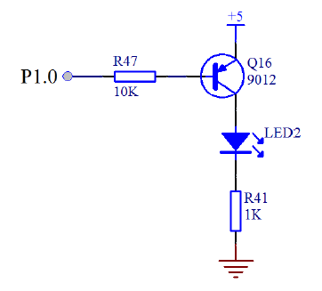

&emsp;&emsp;三极管有三种状态：**截止状态**，**饱和状态**和**放大状态**。通常截止和饱和在数字电路上用的比较多，放大在模拟电路上用的比较多。  
&emsp;&emsp;&emsp;截止状态：e和b之间不导通。  
&emsp;&emsp;&emsp;饱和状态：e和b之间导通，且b极的电流要大于ec间的电流除以β（β为三极管的放大倍数，常用的大概可以认为是100）。  
&emsp;&emsp;&emsp;放大状态：e和b之间导通，且b极的电流要等于ec间的电流除以β。

&emsp;&emsp;上图LED的压降为2V，ec之间的压降为0.2V（先忽略不计），则R41的压降为3V，因此，ec之间的电流为3mA。如果eb要导通，那么eb间的最小电流就是30μA，那么R47最大的阻值为4.3V（5V减去0.7V的压降）除以30μA，为143kΩ。R47只要小于这个阻值就行了，但也不能过于小，单片机的IO输入电流太大会烧坏，STC89C52的最大输入电流推荐小于6mA。

※**三极管的应用**

&emsp;&emsp;三极管的控制应用：**控制应用**，**驱动应用**  
&emsp;&emsp;&emsp;控制应用：如图所示为NPN型三极管，当IO口输出5V高电平的时候，三极管导通，OUT输出低电平；当IO口输出0V低电平的时候，三极管截止，OUT则由于上拉电阻R2的作用而输出12V的高电平。

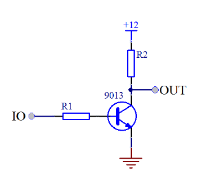

&emsp;&emsp;&emsp;驱动应用：如图IO口直接驱动LED的话，第一种方式IO口电流承受能力有限，一般为6mA，如果LED数量多了，单片机就会受不了。第二种方式IO口电流输出能力有限，一般不到1mA，LED可能点不亮或者亮度很低。

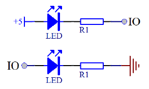

&emsp;&emsp;&emsp;所以就需要用三极管来驱动，如图所示为NPN型三极管来驱动LED，当IO口是高电平的时候，三极管导通，LED就能够被点亮了（9013三极管可以通过500mA的电流）。

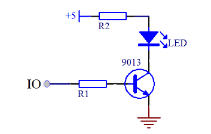

#### 74HC245

&emsp;&emsp;**74HC245是个双向缓冲器**。如果LED多起来的话，总体的电流也相当高，所以需要一个缓冲器来缓冲电流。  
&emsp;&emsp;其中1号引脚DIR为方向引脚，如果DIR为高电平，右侧B编号引脚的电压等于左侧A编号引脚对应的电压；如果DIR为低电平，左侧A编号引脚的电压等于右侧B编号引脚对应的电压。  
&emsp;&emsp;19号引脚OE为使能引脚，叫作输出使能，引脚上的一横表示这个引脚为低电平有效，即OE引脚接低电平时，芯片才工作。

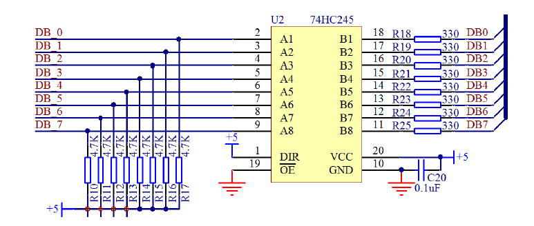

#### 74HC138（三八译码器）

&emsp;&emsp;**74HC138是一种数字芯片，它可以由简单的输入逻辑来控制逻辑输出**三八译码器，就是可以吧3种输入状态翻译成8种输出状态。  
&emsp;&emsp;其中4号引脚E1、5号引脚E2和6号引脚E3为使能引脚，当E1和E2为低电平，E3为高电平时，芯片才工作。  
&emsp;&emsp;其中A0、A1、A2为输入端，Y0-Y7为输出端。

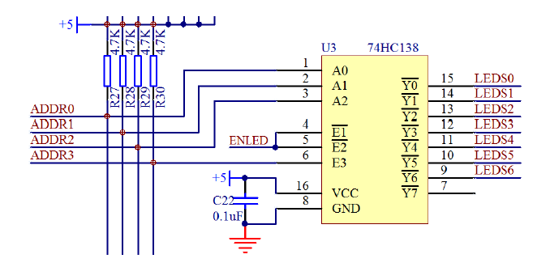

*以下为74HC138的输入输出端的真值表
|A2|A1|A0|⇒|Y0|Y1|Y2|Y3|Y4|Y5|Y6|Y7|
|--|--|--|--|--|--|--|--|--|--|--|--|
|0 |0 |0 |⇒|0 |1 |1 |1 |1 |1 |1 |1 |
|0 |0 |1 |⇒|1 |0 |1 |1 |1 |1 |1 |1 |
|0 |1 |0 |⇒|1 |1 |0 |1 |1 |1 |1 |1 |
|0 |1 |1 |⇒|1 |1 |1 |0 |1 |1 |1 |1 |
|1 |0 |0 |⇒|1 |1 |1 |1 |0 |1 |1 |1 |
|1 |0 |1 |⇒|1 |1 |1 |1 |1 |0 |1 |1 |
|1 |1 |0 |⇒|1 |1 |1 |1 |1 |1 |0 |1 |
|1 |1 |1 |⇒|1 |1 |1 |1 |1 |1 |1 |0 |

### 闪烁LED

&emsp;&emsp;根据开发板的原理图编写程序。如图所示

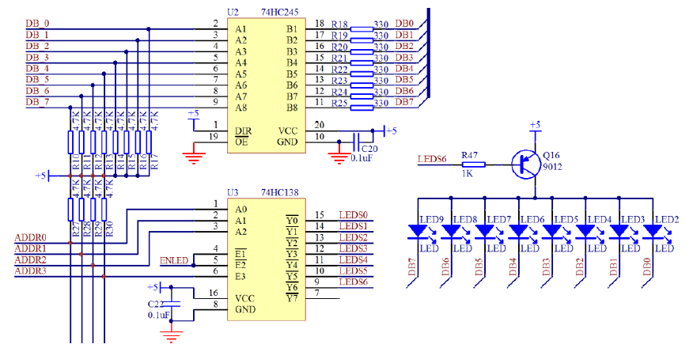

&emsp;&emsp;如LED小灯整体电路图所示要让LED2点亮的话，Q16三极管需要导通，且DB0为低电平。  
&emsp;&emsp;Q16三极管需要导通的话基极为低电平，即LEDS6需要为低电平，即74HC138的9号引脚Y6输出低电平。查真值表可知，需要A2为高电平，A1为高电平，A0为低电平，即ADDR2为高电平，ADDR1为高电平，ADDR0为低电平。同时要让74HC138芯片工作，需要ADDR3为高电平，ENLED为低电平。根据图显示译码和步进电机跳线和单片机电路图所示，即为单片机的P1.0需要低电平，P1.1需要高电平，P1.2需要高电平，P1.3需要高电平，P1.4需要低电平。这时三极管就导通了。  
&emsp;&emsp;DB0连接74HC245的右侧引脚B1，要使B1为低电平的话需要左侧引脚A1为低电平，即DB_0为低电平。DB_0连接到单片机的P0.0引脚上，即P0.0需要低电平，LED就亮。

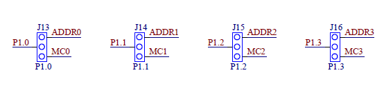

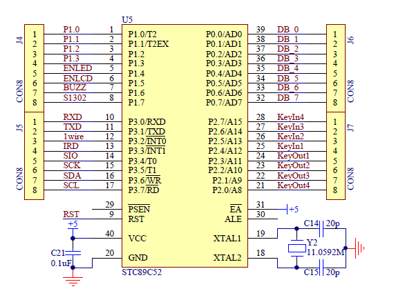

最终的闪烁程序：

```C
#include <reg52.h>

sbit LED = P0.0;
sbit ADDR0 = P1.0;
sbit ADDR1 = P1.1;
sbit ADDR2 = P1.2;
sbit ADDR3 = P1.3;
sbit ENLED = P1.4;

void main()
{
    unsigned int i = 0;     //旧版本C语言需要在最上面定义变量

    //以下为执行语句
    ENLED = 0;      //使能U3（74HC138）的E1和E2
    ADDR3 = 1;      //使能U3（74HC138）的E3，使之能正常输出
    ADDR2 = 1;      //经U3的Y6输出来开启Q16三极管
    ADDR1 = 1;
    ADDR0 = 0;
    while(1)
    {
        LED = 0;                    //点亮小灯
        for(i = 0;i < 30000;i++);   //延时一段时间
        LED = 1;                    //熄灭小灯
        for(i = 0;i < 30000;i++);   //延时一段时间
    }
}
```

---

## Chapter 4 流水灯

---

## Chapter 5 定时器与数码管

---

## Chapter 6

---

## Chapter 7

---

## Chapter 8

---

## Chapter 9

---

## Chapter 10

---
