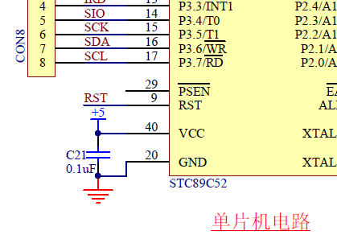
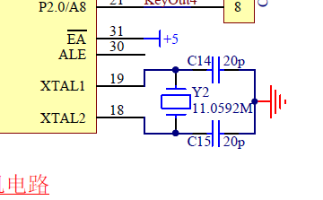
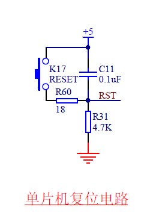
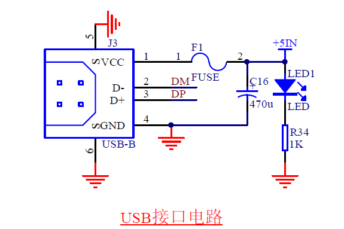

# KingST的C51单片机知识点

## Chapter 1 单片机基础知识

### 单片机的内部资源

#### Flash

&emsp;&emsp;**Flash是程序存储空间**，早期单片机是OTPROM。Flash以其可以重复擦写且容量大成本低的优点为现在绝大多数单片机的程序存储器。Flash最大的意义是断电后数据不丢失。

#### RAM

&emsp;&emsp;**RAM是单片机的数据存储空间**，用来存储程序运行过程中产生和需要的数据，跟计算机的内存是相似的概念。RAM的特点是断电后数据丢失。

#### SFR

&emsp;&emsp;**SFR是特殊功能寄存器**，SFR为用户通过对SFR的读写来实现单片机的多种多样的功能。  
&emsp;&emsp;STC89C52是标准的51体系结构，它的资源为Flash程序空间8K字节，RAM数据空间是512字节，SFR特殊功能寄存器为32各IO，3各定时器，1各UART和8各中断。

### 单片机最小系统

单片机最小系统的三要素就是**电源**，**晶振**和**复位电路**

#### 电源

&emsp;&emsp;目前主流单片机的电源分为5V和3.3V两个标准。STC89C52为5V直流电。+5V通常也称为VCC或者VDD，代表电源正极，GND代表电源的负极。（如原理图单片机供电电路）


#### 晶振

&emsp;&emsp;**晶振的作用就是为单片机系统提供基准时钟信号。**  
单片机的18引脚和19引脚（如原理图单片机晶振电路）接了一个11.0592MHz的晶振（它每秒振荡11059200次），外加两个20pF的电容， **电容的作用是帮助晶振起振，并维持振荡信号的稳定。**


#### 复位电路

&emsp;&emsp;单片机复位一般分为三种情况：上电复位，手动复位和程序自动复位。（如原理图单片机复位电路）


---

## Chapter 2 点亮LED

### LED硬件

#### 发光二极管

&emsp;&emsp;LED即为发光二极管，这种二极管通常的正向导通电压是1.8-2.2V，工作电流一般在1-20mA。  
&emsp;&emsp;其中，当电流在1-5mA之间变化时，随着通过LED的电流越大，灯越亮。  
&emsp;&emsp;而当电流从5-20mA之间变化时，LED亮度变化不大。当电流超过20mA时，LED会有烧坏的风险。

#### 限流电阻

&emsp;&emsp;单片机一般接入VCC的电压是5V，发光二级管的工作自身压降大概是2V，所以就需要电阻来串联分走3V的电压，要求这条路电流范围是1-20mA的话，电阻R的取值范围是150-3kΩ（如原理图USB接口电路的R34为1kΩ，原理图USB供电电路的R35为1kΩ），这个电阻直接限制通路的电流大小，因此这个电阻通常称之为 **“限流电阻”**。


### C51特殊语法

#### sfr

&emsp;&emsp;sfr是关键字，它的作用是定义一个单片机特殊功能寄存器，单片机内部有很多寄存器，如果想使用的话必须提前进行声明。

```C
sfr P0 = 0x80;    //查看手册映射(P0,P1,P2,P3,P4)
```

Keil软件已经将这些声明都写好了，所以用的时候文件开头添加一行

```C
#include <reg52.h>  //内含标准51的映射，加强型51的映射需要使用sfr
```

#### sbit

&emsp;&emsp;sbit是关键字，sfr为映射了一个字节，sbit的作用是单独控制一位。

```C
sbit LED = P0^0;    //LED就表示P0.0这一位
```

### LED程序

一般为了防止程序出错，会在程序结尾加入死循环，让程序停在所希望的位置。

```C
while(1);   //程序停止在这里，写在程序的最后
```

最终的程序：

```C
#include <reg52.h>  //包含特殊功能寄存器定义的头文件

sbit LED = P0^0;    //位地址声明

void main()     //主函数入口
{
    LED = 0;    //将LED(P0.0)置为低电平，根据原理图决定LED的亮灭
    while(1);   //死循环，程序停在这里
}
```

或者

```C
#include <reg52.h>  //包含特殊功能寄存器定义的头文件

sbit LED = P0^0;    //位地址声明

void main()     //主函数入口
{
    while(1)    //进入循环
    {
        LED = 0;    //将LED(P0.0)置为低电平，根据原理图决定LED的亮灭
    }
}
```


---

## Chapter 3 一些硬件知识

### 去耦电容

（1）去耦电容的应用背景：由于电磁干扰（EMI），所以需要应用去耦电容。造成电磁干扰的主要有三种形式，①存在冬天空气干燥造成“静电放电”（ESD），②电机设备使用时的干扰造成“快速瞬间群脉冲”（EFT）以及③热插拔造成“浪涌”（Surge），所以诞生了电磁兼容（EMC）。

### 三极管

### 74HC138（三八译码器）

---

## Chapter 4 流水灯

---

## Chapter 5 定时器与数码管

---
