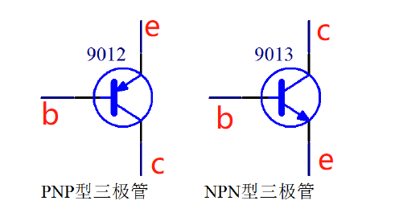
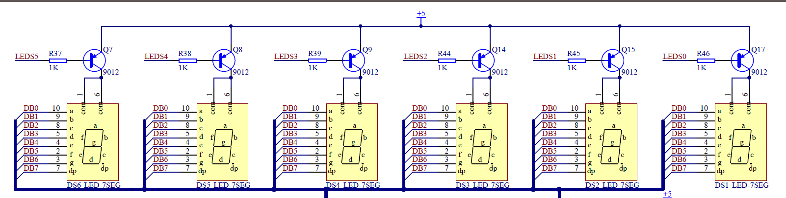

# KingST的C51单片机知识点

## Chapter 1 单片机基础知识

### 单片机的内部资源

#### Flash

&emsp;&emsp;**Flash是程序存储空间**，早期单片机是OTPROM。Flash以其可以重复擦写且容量大成本低的优点为现在绝大多数单片机的程序存储器。Flash最大的意义是断电后数据不丢失。

#### RAM

&emsp;&emsp;**RAM是单片机的数据存储空间**，用来存储程序运行过程中产生和需要的数据，跟计算机的内存是相似的概念。RAM的特点是断电后数据丢失。

#### SFR

&emsp;&emsp;**SFR是特殊功能寄存器**，SFR为用户通过对SFR的读写来实现单片机的多种多样的功能。  
&emsp;&emsp;STC89C52是标准的51体系结构，它的资源为Flash程序空间8K字节，RAM数据空间是512字节，SFR特殊功能寄存器为3个运算器相关的寄存器，3个指针类寄存器，7个口相关的寄存器，2个中断相关的寄存器，6个定时器/计数器相关的寄存器。

### 单片机最小系统

单片机最小系统的三要素就是**电源**，**晶振**和**复位电路**

#### 电源

&emsp;&emsp;目前主流单片机的电源分为5V和3.3V两个标准。STC89C52为5V直流电。+5V通常也称为VCC或者VDD，代表电源正极，GND代表电源的负极。（如原理图单片机供电电路）


#### 晶振

&emsp;&emsp;**晶振的作用就是为单片机系统提供基准时钟信号。**  
单片机的18引脚和19引脚（如原理图单片机晶振电路）接了一个11.0592MHz的晶振（它每秒振荡11059200次），外加两个20pF的电容， **电容的作用是帮助晶振起振，并维持振荡信号的稳定。**


#### 复位电路

&emsp;&emsp;单片机复位一般分为三种情况：上电复位，手动复位和程序自动复位。（如原理图单片机复位电路）


---

## Chapter 2 点亮LED

### LED硬件

#### 发光二极管

&emsp;&emsp;LED即为发光二极管，这种二极管通常的正向导通电压是1.8-2.2V，工作电流一般在1-20mA。  
&emsp;&emsp;其中，当电流在1-5mA之间变化时，随着通过LED的电流越大，灯越亮。  
&emsp;&emsp;而当电流从5-20mA之间变化时，LED亮度变化不大。当电流超过20mA时，LED会有烧坏的风险。

#### 限流电阻

&emsp;&emsp;单片机一般接入VCC的电压是5V，发光二级管的工作自身压降大概是2V，所以就需要电阻来串联分走3V的电压，要求这条路电流范围是1-20mA的话，电阻R的取值范围是150-3kΩ（如原理图USB接口电路的R34为1kΩ），这个电阻直接限制通路的电流大小，因此这个电阻通常称之为 **“限流电阻”**。（图中F1为自恢复保险丝）


### C51特殊语法

#### sfr

&emsp;&emsp;sfr是关键字，它的作用是定义一个单片机特殊功能寄存器，单片机内部有很多寄存器，如果想使用的话必须提前进行声明。

```C
sfr P0 = 0x80;    //查看手册映射(P0,P1,P2,P3,P4)
```

Keil软件已经将这些声明都写好了，所以用的时候文件开头添加一行

```C
#include <reg52.h>  //内含标准51的映射，加强型51的映射需要使用sfr
```

#### sbit

&emsp;&emsp;sbit是关键字，sfr为映射了一个字节，sbit的作用是单独控制一位。

```C
sbit LED = P0^0;    //LED就表示P0.0这一位
```

### LED程序

一般为了防止程序出错，会在程序结尾加入死循环，让程序停在所希望的位置。

```C
while(1);   //程序停止在这里，写在程序的最后
```

最终的点亮程序：

```C
#include <reg52.h>  //包含特殊功能寄存器定义的头文件

sbit LED = P0^0;    //位地址声明

void main()     //主函数入口
{
    LED = 0;    //将LED(P0.0)置为低电平，根据原理图决定LED的亮灭
    while(1);   //死循环，程序停在这里
}
```

或者

```C
#include <reg52.h>  //包含特殊功能寄存器定义的头文件

sbit LED = P0^0;    //位地址声明

void main()     //主函数入口
{
    while(1)    //进入循环
    {
        LED = 0;    //将LED(P0.0)置为低电平，根据原理图决定LED的亮灭
    }
}
```


---

## Chapter 3 一些硬件知识

### 硬件知识

#### 去耦电容

※**去耦电容的应用背景**

&emsp;&emsp;由于电磁干扰（EMI），所以需要应用去耦电容。造成电磁干扰的主要有三种形式  
&emsp;&emsp;&emsp;①存在冬天空气干燥造成“静电放电”（ESD）  
&emsp;&emsp;&emsp;②电机设备使用时的干扰造成“快速瞬间群脉冲”（EFT）  
&emsp;&emsp;&emsp;③热插拔造成的“浪涌”（Surge）  
&emsp;&emsp;基于上面的问题，所以诞生了电磁兼容（EMC）。

※**耦电容的应用：大电容低频滤波，小电容高频滤波。**

&emsp;&emsp;大电容（如原理图电源开关电路的C19）的作用为  
&emsp;&emsp;&emsp;①缓冲作用：上电瞬间，让电流缓慢流入电路。  
&emsp;&emsp;&emsp;②稳定作用：后级电路功率大小不一样，所需电流也不一样，可能导致启动有先后，有电容就可以稳定整个电路的电压不会下降太多。  
&emsp;&emsp;大电容的选取：  
&emsp;&emsp;&emsp;第一个参数是耐压值的考虑：一般为系统电压的1.5倍到2倍（一般单片机系统为5V），有些场合可以稍微再高一点。
&emsp;&emsp;&emsp;第二个参数是电容容量的考虑：根据整套系统的功率消耗情况决定，如果系统耗电较大，波动可能比较大，容值就要选大一些的，反之可以小一些。

&emsp;&emsp;小电容（如原理图电源开关电路的C10）的作用为：滤除高频信号的干扰。一般在IC供电的地方都会加上这个小电容，在布线的时候还会考虑尽可能靠近IC。  
&emsp;&emsp;小电容的选取：在电源处的去耦高频电容，直接选用0.1μF（104电容⇒10×10^4pF=100nF=0.1μF）。


#### 三极管

&emsp;&emsp;三极管是模拟电路和数字电路中经常会用到的一个器件，三极管可分为**PNP型三极管**和**NPN型三极管**。三极管一共有3个极，横向左侧的的引脚叫作**基极b**（base），中间的箭头一头连接基极，一头连接**发射极e**（emitter），剩下一个引脚就是**集电极c**（collector）。



※**三极管的原理**

&emsp;&emsp;三极管的关键点在于b极和e极之间的电压关系。以PNP型为例，e极电压只要高于b极电压0.7V以上，这个三极管的e极和c极之间就是顺利导通的。也可是说控制端在b和e之间，被控制端在b和c之间。如原理图所示，当P1.0处于高电平（5V）的时候，e和b之间无压降，所以三极管e和c之间不导通，LED就不亮；当P1.0处于低电平（0V）的时候，e和b之间有压降且大于0.7V，三极管e和c之间导通，LED就亮。（e和c之间大概会有0.2V的压降）


&emsp;&emsp;三极管有三种状态：**截止状态**，**饱和状态**和**放大状态**。通常截止和饱和在数字电路上用的比较多，放大在模拟电路上用的比较多。  
&emsp;&emsp;&emsp;截止状态：e和b之间不导通。  
&emsp;&emsp;&emsp;饱和状态：e和b之间导通，且b极的电流要大于ec间的电流除以β（β为三极管的放大倍数，常用的大概可以认为是100）。  
&emsp;&emsp;&emsp;放大状态：e和b之间导通，且b极的电流要等于ec间的电流除以β。

&emsp;&emsp;上图LED的压降为2V，ec之间的压降为0.2V（先忽略不计），则R41的压降为3V，因此，ec之间的电流为3mA。如果eb要导通，那么eb间的最小电流就是30μA，那么R47最大的阻值为4.3V（5V减去0.7V的压降）除以30μA，为143kΩ。R47只要小于这个阻值就行了，但也不能过于小，单片机的IO输入电流太大会烧坏，STC89C52的最大输入电流推荐小于6mA。

※**三极管的应用**

&emsp;&emsp;三极管的控制应用：**控制应用**，**驱动应用**  
&emsp;&emsp;&emsp;控制应用：如图所示为NPN型三极管，当IO口输出5V高电平的时候，三极管导通，OUT输出低电平；当IO口输出0V低电平的时候，三极管截止，OUT则由于上拉电阻R2的作用而输出12V的高电平。


&emsp;&emsp;&emsp;驱动应用：如图IO口直接驱动LED的话，第一种方式IO口电流承受能力有限，一般为6mA，如果LED数量多了，单片机就会受不了。第二种方式IO口电流输出能力有限，一般不到1mA，LED可能点不亮或者亮度很低。


&emsp;&emsp;&emsp;所以就需要用三极管来驱动，如图所示为NPN型三极管来驱动LED，当IO口是高电平的时候，三极管导通，LED就能够被点亮了（9013三极管可以通过500mA的电流）。


#### 74HC245

&emsp;&emsp;**74HC245是个双向缓冲器**。如果LED多起来的话，总体的电流也相当高，所以需要一个缓冲器来缓冲电流。  
&emsp;&emsp;其中1号引脚DIR为方向引脚，如果DIR为高电平，右侧B编号引脚的电压等于左侧A编号引脚对应的电压；如果DIR为低电平，左侧A编号引脚的电压等于右侧B编号引脚对应的电压。  
&emsp;&emsp;19号引脚OE为使能引脚，叫作输出使能，引脚上的一横表示这个引脚为低电平有效，即OE引脚接低电平时，芯片才工作。


#### 74HC138（三八译码器）

&emsp;&emsp;**74HC138是一种数字芯片，它可以由简单的输入逻辑来控制逻辑输出**三八译码器，就是可以吧3种输入状态翻译成8种输出状态。  
&emsp;&emsp;其中4号引脚E1、5号引脚E2和6号引脚E3为使能引脚，当E1和E2为低电平，E3为高电平时，芯片才工作。  
&emsp;&emsp;其中A0、A1、A2为输入端，Y0-Y7为输出端。


*以下为74HC138的输入输出端的真值表

|A2|A1|A0|⇒|Y0|Y1|Y2|Y3|Y4|Y5|Y6|Y7|
|--|--|--|--|--|--|--|--|--|--|--|--|
|0 |0 |0 |⇒|0 |1 |1 |1 |1 |1 |1 |1 |
|0 |0 |1 |⇒|1 |0 |1 |1 |1 |1 |1 |1 |
|0 |1 |0 |⇒|1 |1 |0 |1 |1 |1 |1 |1 |
|0 |1 |1 |⇒|1 |1 |1 |0 |1 |1 |1 |1 |
|1 |0 |0 |⇒|1 |1 |1 |1 |0 |1 |1 |1 |
|1 |0 |1 |⇒|1 |1 |1 |1 |1 |0 |1 |1 |
|1 |1 |0 |⇒|1 |1 |1 |1 |1 |1 |0 |1 |
|1 |1 |1 |⇒|1 |1 |1 |1 |1 |1 |1 |0 |

### 闪烁LED

&emsp;&emsp;根据开发板的原理图编写程序。如图所示


&emsp;&emsp;如LED小灯整体电路图所示要让LED2点亮的话，Q16三极管需要导通，且DB0为低电平。  
&emsp;&emsp;Q16三极管需要导通的话基极为低电平，即LEDS6需要为低电平，即74HC138的9号引脚Y6输出低电平。查真值表可知，需要A2为高电平，A1为高电平，A0为低电平，即ADDR2为高电平，ADDR1为高电平，ADDR0为低电平。同时要让74HC138芯片工作，需要ADDR3为高电平，ENLED为低电平。根据图显示译码和步进电机跳线和单片机电路图所示，即为单片机的P1.0需要低电平，P1.1需要高电平，P1.2需要高电平，P1.3需要高电平，P1.4需要低电平。这时三极管就导通了。  
&emsp;&emsp;DB0连接74HC245的右侧引脚B1，要使B1为低电平的话需要左侧引脚A1为低电平，即DB_0为低电平。DB_0连接到单片机的P0.0引脚上，即P0.0需要低电平，LED就亮。


最终的闪烁程序：

```C
#include <reg52.h>

sbit LED = P0^0;
sbit ADDR0 = P1^0;
sbit ADDR1 = P1^1;
sbit ADDR2 = P1^2;
sbit ADDR3 = P1^3;
sbit ENLED = P1^4;

void main()
{
    unsigned int i = 0;     //旧版本C语言需要在最上面定义变量

    //以下为执行语句
    ENLED = 0;      //使能U3（74HC138）的E1和E2
    ADDR3 = 1;      //使能U3（74HC138）的E3，使之能正常输出
    ADDR2 = 1;      //经U3的Y6输出来开启Q16三极管
    ADDR1 = 1;
    ADDR0 = 0;
    while(1)
    {
        LED = 0;                    //点亮小灯
        for(i = 0;i < 30000;i++);   //延时一段时间
        LED = 1;                    //熄灭小灯
        for(i = 0;i < 30000;i++);   //延时一段时间
    }
}
```

---

## Chapter 4 C语言和流水灯

### C语言基础

#### 变量和范围

&emsp;&emsp;**书写二进制数据时需要加前缀0b，书写十六进制数据时需要加前缀0x。**

&emsp;&emsp;C语言的基本类型由  
&emsp;&emsp;&emsp;字符型：无符号字符型unsigned char(范围为0～255)；字符型signed char(范围-128～127)  
&emsp;&emsp;&emsp;整型：无符号整型unsigned int(范围为0～65535)；字符型signed int(范围-32768～32767)  
&emsp;&emsp;&emsp;长整型：无符号字符型unsigned long(范围为0～4294967295)；字符型signed long(范围-2147483648～2147483647)  
&emsp;&emsp;&emsp;浮点型：单精度浮点型float(范围为-3.4*10^38～3.4*10^38；双精度浮点型double（C51里等同于float）)

#### 基本运算符

&emsp;&emsp;C语言中的基本运算符加（+）减（-）乘（*）除（/）取余（%）  
&emsp;&emsp;C语言中的自加（++）自减（--）。其中a++为先做其他运算，再做自加运算；++a为先做自加运算，再做其他运算。  
&emsp;&emsp;C语言中的赋值运算符为“=”，即将右边的值赋给左边。
&emsp;&emsp;C语言中比较运算符为“==”（判断相等）和“！=”（判断不相等）。  
&emsp;&emsp;C语言中的移位运算符“<<”左移和“>>”右移。左移为最低位填0补充，其他位向左移动，比如1000 0001左移一位为0000 0010。右移位最高位填0补充，其他位向右移动，比如0000 1111右移一位为0100 0000。  
&emsp;&emsp;C语言中的取反运算符为“~”这个符号的意思是按位取反。比如1000 0001按位取反后为0111 1110。

#### 循环语句

&emsp;&emsp;for循环：  
&emsp;&emsp;&emsp;执行过程中初始化语句执行且只执行一次。判断语句为条件成立就执行需要执行的语句，条件不成立就跳出循环。更新语句是在需要执行的语句执行完后进行执行。

```C
for (初始化语句;判断语句;更新语句)
{
    需要执行的语句
}
例如
for (i = 0;i < 2;i++)
{
    a = a + b;
}
```

&emsp;&emsp;while循环：  
&emsp;&emsp;&emsp;如果判断语句为真则执行需要执行的语句，如果判断语句为假则跳出循环。**需要注意的是while循环不带更新，所以在需要执行的语句中需要有更新判断语句的句子，不然就是死循环了。**

```C
while(判断语句)
{
    需要执行的语句
}
例如
while(i < 0)
{
    a = a + b;
    i--;
}
```

#### 函数

&emsp;&emsp;函数的一般形式为

```C
函数值类型 函数名 (形式参数列表)
{
    函数体
}
```

&emsp;&emsp;函数值类型为输出的类型，不为空时函数体需要有return语句。  
&emsp;&emsp;形式参数列表为输入这个函数的类型。  
&emsp;&emsp;函数体里通常为声明语句和执行语句。  
&emsp;&emsp;**一个工程里有且只有一个main函数**，程序执行的时候都是从这里开始的。

### 流水灯

&emsp;&emsp;在流水灯实验前，看一下另外一种使用给P0赋值的方式点亮LED。

```C
#include<reg52.h>

sbit ADDR0 = P1^0;
sbit ADDR1 = P1^1;
sbit ADDR2 = P1^2;
sbit ADDR3 = P1^3;
sbit ENLED = P1^4;

void main()
{
    //执行语句
    ENLED = 0;      //使能U3（74HC138）的E1和E2
    ADDR3 = 1;      //使能U3（74HC138）的E3，使之能正常输出
    ADDR2 = 1;      //经U3的Y6输出来开启Q16三极管
    ADDR1 = 1;
    ADDR0 = 0;
    P0 = 0xFE;      //向P0写入数据来控制LED小灯，0xFE为1111 1110
    while(1);
}
```

&emsp;&emsp;要实现流水灯从左往右亮，且LED为低电平才点亮。相当于需要对P0进行了左移后进行取反。比如点亮LED1为1111 1110，点亮LED2为1111 1101。那么就相当于取反之前为0000 0001和0000 0010，即为进行了左移。只要初始设定为0000 0001后，每进行一次左移再取反即可实现流水灯的效果。

```C
#include<reg52.h>

sbit ADDR0 = P1^0;
sbit ADDR1 = P1^1;
sbit ADDR2 = P1^2;
sbit ADDR3 = P1^3;
sbit ENLED = P1^4;

void main()
{
    //声明语句
    unsigned char cnt = 0; //用来移位控制
    unsigned int i = 0;     //用来软件延时
    //执行语句
    ENLED = 0;      //使能U3（74HC138）的E1和E2
    ADDR3 = 1;      //使能U3（74HC138）的E3，使之能正常输出
    ADDR2 = 1;      //经U3的Y6输出来开启Q16三极管
    ADDR1 = 1;
    ADDR0 = 0;
    while(1)
    {
        P0 = ~(0x01 << cnt);        //进行左移cnt位后取反即位点亮LED
        for(i = 0;i < 20000;i++)    //延时一段时间
        cnt++;                     //下次循环时，移动的位数加1即为点亮下一个LED
        if(cnt >= 8)
        {
            cnt = 0;                //如果移动位数超过7后需要重新计数
        }
    }
}
```

---

## Chapter 5 定时器与数码管

### 逻辑电路和逻辑运算


#### 逻辑与&emsp;&&

&emsp;&emsp;F=A&&B，当A、B的值都为真，其运算结果F为真，当A、B的值任意一个为假，其运算结果F为假。

#### 逻辑或&emsp;||

&emsp;&emsp;F=A||B，当A、B的值任意一个为真，其运算结果F为真，当A、B的值都为假，其运算结果F为假。

#### 逻辑非&emsp;!&emsp;

&emsp;&emsp;F=!A，当A的值为真，其运算结果F为假，当A的值都为假，其运算结果F为真。

#### 按位与&emsp;&

&emsp;&emsp;F=A&B，将A、B两个字节的每一位都进行与运算，其运算结果为F。例如A=1100 1100、B=1111 0000，则F=1100 0000。

#### 按位或&emsp;|

&emsp;&emsp;F=A|B，将A、B两个字节的每一位都进行或运算，其运算结果为F。例如A=1100 1100、B=1111 0000，则F=1111 1100。

#### 按位取反&emsp;~

&emsp;&emsp;F=~A，将A的每一位都进行取反运算，其运算结果为F。例如A=1100 1100，F=0011 0011。

#### 按位异或&emsp;^

&emsp;&emsp;F=A^B，异或的意思是，如果运算双方的值不同则为真，如果运算双方的值相同则为假。例如A=1100 1100、B=1111 0000，则F=0011 1100。

### 定时器

&emsp;&emsp;**时钟周期：时钟周期T是时序中最小的时间单位。**具体算法就是时钟周期=1/时钟源频率，KST-51开发板上用的晶振是11.0592MHz，所以时钟周期为1/11059200秒。

&emsp;&emsp;**机器周期：单片机完成一个操作的最短时间（主要针对与汇编语言，汇编语言程序每一条语句的执行所用的时间都是机器周期的整数倍）。**标准51单片机（C51）的一个机器周期是12个时钟周期，也就是12/11059200秒。

&emsp;&emsp;标准51单片机（C51）有两个定时器/计数器，为T0，T1。而STC89C52的资源多个定时器/计数器T2。目前先不看T2，只看T0和T1。**T0和T1共3种6个寄存器，分别为定时值存储寄存器：T0高八位TH0，T0低八位TL0，T1高八位TH1，T1低八位TL1；定时器控制寄存器：TCON；定时器模式寄存器：TMOD。**

#### 定时存储寄存器

&emsp;&emsp;定时存储寄存器有4个，TH0，TL0，TH1，TL1。  
&emsp;&emsp;&emsp;TH0寄存器：SFR地址为0x8C，复位值为0x00，不可位寻址  
&emsp;&emsp;&emsp;TL0寄存器：SFR地址为0x8A，复位值为0x00，不可位寻址  
&emsp;&emsp;&emsp;TH1寄存器：SFR地址为0x8D，复位值为0x00，不可位寻址  
&emsp;&emsp;&emsp;TL1寄存器：SFR地址为0x8B，复位值为0x00，不可位寻址

&emsp;&emsp;定时存储器的作用为当低八位计满时，高八位计1，直至高八位低八位全部被计满就重新开始计。

#### 定时控制寄存器

&emsp;&emsp;定时器控制寄存器有1个，为TCON，SFR地址位0x88，可位寻址，各个位的复位值均为0。

&emsp;&emsp;TCON的各个位的作用：  
&emsp;&emsp;&emsp;TF1（位7）：定时器1溢出标志位。一旦定时器1发生溢出（高八位和低八位都计满）时硬件置1.清零方式有两种，分别位软件清零（通过程序清零）和硬件清零（通过看门狗之类的单片机自动清零）。  
&emsp;&emsp;&emsp;TR1（位6）：定时器1运行控制位。软件置位/清零来进行启动/停止定时器。  
&emsp;&emsp;&emsp;TF0（位5）：定时器0溢出标志位。作用和TF1一样。  
&emsp;&emsp;&emsp;TR0（位4）：定时器1运行控制位。作用和TR1一样。  
&emsp;&emsp;&emsp;IE1（位3）：中断相关先不管。  
&emsp;&emsp;&emsp;IT1（位2）：中断相关先不管。  
&emsp;&emsp;&emsp;IE0（位1）：中断相关先不管。  
&emsp;&emsp;&emsp;IT0（位0）：中断相关先不管。  


&emsp;&emsp;TR1（位6）/TR0（位4）：**定时器运行位**当程序中写TR = 1以后，定时器就会每经过一个机器周期自动加1。当程序中写TR = 0以后，定时器就停止加1，其值（TH1/0和TL1/0）保持不变。

&emsp;&emsp;TF1（位7）/TF0（位5）：**定时器标志位**它的作用是告诉我们定时器溢出了。当TH1/0和TL1/0同时计满时，TF1/0会自动变成1，但不影响定时器继续工作。

#### 定时模式寄存器

&emsp;&emsp;定时器模式寄存器有1个，为TMOD，SFR地址位0x89，不可位寻址，复位值位0x00。

&emsp;&emsp;TMOD的各个位的作用：  
&emsp;&emsp;&emsp;GATE（位7）：定时器1门控位。置1时只有在INT1脚为高及TR1控制位置1才可以打开定时器。  
&emsp;&emsp;&emsp;C/T（位6）：T1的定时器计数器选择位。清零时为选择定时器，置1时为选择计数器。  
&emsp;&emsp;&emsp;M1（位5）：M1和M0共同组成T1的4种工作模式的选择。  
&emsp;&emsp;&emsp;M0（位4）：M1和M0共同组成T1的4种工作模式的选择。  
&emsp;&emsp;&emsp;GATE（位3）：定时器0门控位。作用和GATE（位7）也就是T1的相同  
&emsp;&emsp;&emsp;C/T（位2）：T0的定时器计数器选择位。作用和C/T（位6）也就是T1的选择位相同  
&emsp;&emsp;&emsp;M1（位1）：M1和M0共同组成T0的4种工作模式的选择。  
&emsp;&emsp;&emsp;M0（位0）：M1和M0共同组成T0的4种工作模式的选择。  


&emsp;&emsp;定时器的4种工作模式：  
&emsp;&emsp;&emsp;M1=0，M0=0的模式0：兼容8048单片机的13位定时器，THn的8位和TLn的5位组成13位定时器。（不常用）


&emsp;&emsp;&emsp;M1=0，M0=1的模式1：THn和TLn组成一个16位的定时器。（最常用）


&emsp;&emsp;&emsp;M1=1，M0=0的模式2：8位自动重装模式，定时器溢出后将THn重装到TLn。（溢出后将THn的值赋值给TLn）


&emsp;&emsp;&emsp;M1=1，M0=1的模式3：禁用定时器1，定时器0变成2个8位定时器。（不常用）


&emsp;&emsp;根据模式示意图，定时器部分OSC为时钟频率，d为12，出来的就是机器周期。要启动定时器，C/T要清零，为选择定时器，控制那里要置1，那么与门两边都要为1，那么TRn就要为1，下路的或门的输出也要为1，或门输出为1，那么INTn和非门输出至少有一个为1，非门为GATE位的取反。所以，得出：  
&emsp;&emsp;&emsp;1.TRn一定要置1。
&emsp;&emsp;&emsp;2.当INTn（P3.2引脚）为1时，GATE清零置1都可以。当INTn为0时，GATE一定要清零，定时器才会工作。
&emsp;&emsp;&emsp;3.C/T=0时，为定时器，**定时器本质就是计数器，只是它计数的是晶振的数**计数经过了几个机器周期。C/T=1时，为计数器，就是计数外部脉冲的个数。

#### 定时器的使用的一般流程

&emsp;&emsp;使用定时器一般需要以下步骤：  
&emsp;&emsp;&emsp;第一步：设置定时器模式寄存器TMOD，配置好工作模式（不可位寻址，按字节赋值）。  
&emsp;&emsp;&emsp;第二步：设置定时器存储寄存器THn和TLn的初始值（不可位寻址，按字节赋值，通常位TH0=0xB8，TL0=0x00即位0。02s）。  
&emsp;&emsp;&emsp;第三步：设置定时器控制寄存器TCON，可位寻址，所以通过TRn置1来让定时器开始计数。  
&emsp;&emsp;&emsp;第四步：判断定时器控制寄存器TCON中的TFn位来监测定时器溢出情况。  
&emsp;&emsp;关于THn=0xB8，TLn=0x00的计算。一个机器周期位12/11059200秒，当计到第18432个机器周期即位经过了0.02s。而溢出值是65536，那么从65536-18432=47104开始计，经过18432个机器周期（0.02s），定时器就溢出了，同时TFn被置1.而47104的16进制就是0xB800，即高八位位0xB8，低八位位0x00。利用定时0.02s可以使用50倍变成1s。

```C
#inluced<reg52.h>

sbit LED = P0^0;
sbit ADDR0 = P1^0;
sbit ADDR1 = P1^1;
sbit ADDR2 = P1^2;
sbit ADDR3 = P1^3;
sbit ENLED = P1^4;

void main()
{
    //声明语句
    unsigned char cnt = 0;  //用于记录T0溢出次数
    //执行语句
    //LED部门
    ENLED = 0;  //使能U3的74HC138
    ADDR3 = 1;
    ADDR2 = 1;  //使LEDS6输出低电平来选择独立LED
    ADDR1 = 1;
    ADDR0 = 0;

    //定时器部分
    TMOD = 0x01;    //设置T0为模式1
    TH0 = 0xB8;     //T0赋初值为0xB800即为0.02s
    TL0 = 0x00;
    TR0 = 1;    //启动T0

    while(1)
    {
        if(TF0 == 1)    //判断T0是否溢出，1为溢出
        {
            TF0 = 0;    //T0溢出后，清除标志
            TH0 = 0xB8; //溢出后会重新计数，所以需要再赋值
            TL0 = 0x00;
            cnt++;
            if(cnt >= 50)   //溢出50次为过了1s
            {
                cnt = 0;    //达到1s后计数清零
                LED = ~LED; //LED取反即为亮灭闪烁
            }
        }
    }
}
```

### 数码管基础

#### 点亮数码管

&emsp;&emsp;数码管也是一种LED，常见的数码管分为共阴和共阳。共阴就是所有LED的阴极连接在一起，由阳极控制小灯的亮灭。共阳就是所有LED的阳极连接在一起，由阴极控制小灯的亮灭。


&emsp;&emsp;由数码管原理图可以看出通过控制abcdefg和dp来控制数码管的显示。关于公共端由两个，公共端通过的电流较大，所以用两个公共端并联来进行分流。

&emsp;&emsp;由开发板原理图可知，控制最右边的数码管是通过74HC138输出LEDS0为低电平来控制的，所以U3的75HC138为ADDR2，ADDR1和ADDR0都置0，LEDS0输出0。要让数码管显示数字1，那么就点亮b段和c段，对应就是DB1和DB2都置0。对应的P0就是0b1111 1001，十六进制就是0xF9。




&emsp;&emsp;数码管显示1的程序。

```C
#inluced<reg52.h>

sbit ADDR0 = P1^0;
sbit ADDR1 = P1^1;
sbit ADDR2 = P1^2;
sbit ADDR3 = P1^3;
sbit ENLED = P1^4;

void main()
{
    //执行语句
    ENLED = 1;  //使能U3的74HC138
    ADDR3 = 1;
    ADDR2 = 0;  //使Q17三极管导通选择控制DS1
    ADDR1 = 0;
    ADDR0 = 0;

    P0 = 0xF9;  //点亮数码管b段和c段即为点亮显示1
    while(1);
}
```

#### 数码管和定时器结合的计时器

&emsp;&emsp;数码管每一秒进行加1就为数码管的计时器。数码管0-F的真值表如下。利用数组将真值表的数值填入，利用数组的角标来控制P0的值。可以利用code关键词来将真值表进行修饰，这样真值表就会被写入Flash。从而节约RAM空间。


```C
#inluced<reg52.h>

sbit ADDR0 = P1^0;
sbit ADDR1 = P1^1;
sbit ADDR2 = P1^2;
sbit ADDR3 = P1^3;
sbit ENLED = P1^4;

//用数组来存储数码管的真值表
unsigned char code LedChar[] = {
    0xC0, 0xF9, 0xA4, 0xB0, 0x99, 0x92, 0x82, 0xF8,
    0x80, 0x90, 0x88, 0x83, 0xC6, 0xA1, 0x86, 0x8E
};

void main()
{
    //声明语句
    unsigned char cnt = 0;  //记录T0溢出次数
    unsigned char sec = 0;  //记录经过的秒数
    //执行语句
    //数码管部分
    ENLED = 0;  //使能U3的74HC138
    ADDR3 = 1;
    ADDR2 = 0;  //使Q17三极管导通选择控制DS1
    ADDR1 = 0;
    ADDR0 = 0;
    //定时器部分
    TMOD = 0x01;    //设置T0为模式1
    TH0 = 0xB8;     //T0赋初值为0xB800即为0.02s
    TL0 = 0x00;
    TR0 = 1;    //启动T0

    while(1)
    {
        if(TF == 1) //判断T0是否溢出，1为溢出
        {
            TF0 = 0;    //T0溢出后，清除标志
            TH0 = 0xB8; //溢出后会重新计数，所以需要再赋值
            TL0 = 0x00;
            cnt++;
            if(cnt >= 50)   //溢出50次为过了1s
            {
                cnt = 0;
                P0 = LEDChar[sec];
                sec++;  //每经过1秒要加1
                if(sec >= 16)   //如果秒数超过了16，重新从0开始
                {
                    sec = 0;
                }
            }
        }
    }    
}
```

---

## Chapter 6 中断与数码管动态显示

### C语言基础2

#### 数组

&emsp;&emsp;**数组是具有相同数据类型的有序数据的组合。**一般来讲要满足以下三个条件：  
&emsp;&emsp;&emsp;1.具有相同的数据类型。  
&emsp;&emsp;&emsp;2.具有相同的名字。  
&emsp;&emsp;&emsp;3.在存储器中是被连续存放的。

&emsp;&emsp;数组的声明：  
&emsp;&emsp;&emsp;数据类型 数组名[数组长度];  
&emsp;&emsp;&emsp;1.数组的数据类型声明是该数组的每个元素的类型。  
&emsp;&emsp;&emsp;2.数组名的声明要符合C语言的标识符的声明要求，只能由字母、数字、下划线。  
&emsp;&emsp;&emsp;3.方括号中的数组长度是一个常量或常量表达式，并且必须是正整数。

&emsp;&emsp;数组的初始化：  
&emsp;&emsp;&emsp;数据类型 数组名[数组长度] = {初值列表};  
&emsp;&emsp;&emsp;1.初值列表里的数据之间要用逗号隔开。  
&emsp;&emsp;&emsp;2.初值列表里的初值的数量必须小于或等于数组长度，当小于数组长度，数组的后边没有赋值的话就自动赋值为0。  
&emsp;&emsp;&emsp;3.数组长度可以省略。初始化列表由几个元素，数组就有多长。  
&emsp;&emsp;&emsp;4.系统为数组分配连续的存储单元的时候，数组元素的相对次序由下标来决定。  

&emsp;&emsp;数组的使用：  
&emsp;&emsp;&emsp;1.引用数组的时候，方括号里的数字代表数组元素的下标，而在初始化的时候代表元素的个数。  
&emsp;&emsp;&emsp;2.数组元素的方括号里可以是整型常数，整型变量或者表达式，而数组初始化的时候必须是常量不能是变量。  
&emsp;&emsp;&emsp;3.数组整体赋值只能在初始化的时候进行，程序执行代码中只能对单个元素赋值。  
&emsp;&emsp;&emsp;4.加了code关键字的数组为只读，没加的数组可读可写。

#### if语句

&emsp;&emsp;if为条件判断语句，一共有三种格式：

```C
if(条件表达式)
{
    语句1;
}
```

```C
if(条件表达式)
{
    语句1;
}
else
{
    语句2;
}
```

```C
if(条件语句1)
{
    语句1;
}
else if(条件语句2)
{
    语句2;
}
else
{
    语句3;
}
```

&emsp;&emsp;在第三种形式中，有一个条件表达式满足条件就会跳出整个判断。

#### switch语句

&emsp;&emsp;switch也为条件判断语句，格式如下：

```C
switch(表达式)
{
    case 常量表达式1 : 语句1;
    case 常量表达式2 : 语句2;
    case 常量表达式n : 语句n;
    default : 语句n+1;
}
```

&emsp;&emsp;这种格式有一个明显的缺点，即使有一个条件表达式满足目标，它也不会跳出，会继续进行条件判断。所以需要使用break关键字。

```C
switch(表达式)
{
    case 常量表达式1 : 语句1;break;
    case 常量表达式2 : 语句2;break;
    case 常量表达式n : 语句n;break;
    default : 语句n+1;break;
}
```

### 数码管的动态显示

#### 动态显示的基本原理

&emsp;&emsp;由数码管的电路图可以看出，由于51单片机资源不够，所以一次只能点亮一个数码管，点亮多个数码管其实是轮流点亮的，利用人眼的视觉暂留现象（也叫余晖效应），可以做到看起来所有数码管同时亮起，这个就是动态显示，也叫动态扫描。


&emsp;&emsp;**关于动态显示的刷新时间，一般刷新率大于100Hz即刷新时间小于10ms**，那么就可以看起来是无闪烁的了。开发板有6个数码管，每个数码管点亮1ms，刷新一轮需要6ms，比较接近10ms，所以定时器就初始为1ms的定时器。  
&emsp;&emsp;那么要做一个秒表的程序的主程序要做的事情就清楚了，分别为：每1ms点亮一个数码管，依次点亮。每1s显示的数字加1。

&emsp;&emsp;使用if语句的方式：

```C
include<reg52.h>

sbit ADDR0 = P1^0;
sbit ADDR1 = P1^1;
sbit ADDR2 = P1^2;
sbit ADDR3 = P1^3;
sbit ENLED = P1^4;

//用数组来存储数码管的真值表
unsigned char code LedChar[] = {
    0xC0, 0xF9, 0xA4, 0xB0, 0x99, 0x92, 0x82, 0xF8,
    0x80, 0x90
};
//数码管显示缓冲区，初值0xFF确保启动是所有数码管都不亮
unsigned char LedBuff[6] = {
    0xFF, 0xFF, 0xFF, 0xFF, 0xFF, 0xFF
}

void main()
{
    //声明局部变量语句
    unsigned int cnt = 0;   //记录T0溢出次数
    unsigned char i = 0;    //动态扫描的索引，即数码管的脚标
    unsigned long sec = 0;  //记录经过的秒数
    //执行语句
    //LED部分
    ENLED = 0;  //使能U3的74HC138
    ADDR3 = 1;  //因为需要动态改变ADDR0-2的值，所有不用再初始化了

    //定时器部分
    TMOD = 0x01;    //设定定时器T0为模式1
    TH0 = 0xFC;     //T0赋值0xFC67，定时为1ms
    TL0 = 0x67;
    TR0 = 1;    //启动T0

    while(1)
    {
        if(TF0 == 1)    //判断定时器T0是否溢出，即为已计时1ms
        {
            TF0 = 0;    //定时器T0溢出后，清除中断标志
            TH0 = 0xFC; //定时器T0溢出后，重新赋值
            TL0 = 0x67;
            cnt++;
            if(cnt >= 1000 )    //达到1s
            {
                cnt = 0;    //达到1s后计数清零
                sec++;      //经过一秒秒计数加1

                //以下代码将sec按十进制从低位到高位依次存到显示缓冲区中
                LedBuff[0] = LedChar[sec % 10];
                LedBuff[1] = LedChar[sec / 10 % 10];
                LedBuff[2] = LedChar[sec / 100 % 10];
                LedBuff[3] = LedChar[sec / 1000 % 10];
                LedBuff[4] = LedChar[sec / 10000 % 10];
                LedBuff[5] = LedChar[sec / 10000 % 10];
            }

            //每次1ms中断都要刷新一下数码管
            //以下为数码管动态扫描刷新
            P0 = 0xFF;  //消影
            if(i == 0)
            {ADDR2 = 0;ADDR1 = 0;ADDR0 = 0;i++;P0 = LedBuff[0];}    //第一次溢出点亮第一个数码管
            else if(i == 1)
            {ADDR2 = 0;ADDR1 = 0;ADDR0 = 1;i++;P0 = LedBuff[1];}    //第二次溢出点亮第二个数码管
            else if(i == 2)
            {ADDR2 = 0;ADDR1 = 1;ADDR0 = 0;i++;P0 = LedBuff[2];}    //第三次溢出点亮第三个数码管
            else if(i == 3)
            {ADDR2 = 0;ADDR1 = 1;ADDR0 = 1;i++;P0 = LedBuff[3];}    //第四次溢出点亮第四个数码管
            else if(i == 4)
            {ADDR2 = 1;ADDR1 = 0;ADDR0 = 0;i++;P0 = LedBuff[4];}    //第五次溢出点亮第五个数码管
            else(i == 5)
            {ADDR2 = 1;ADDR1 = 0;ADDR0 = 1;i = 0;P0 = LedBuff[5];}  //第六次溢出点亮第六个数码管
        }
    }
}
```

&emsp;&emsp;使用switch语句的方式：

```C
include<reg52.h>

sbit ADDR0 = P1^0;
sbit ADDR1 = P1^1;
sbit ADDR2 = P1^2;
sbit ADDR3 = P1^3;
sbit ENLED = P1^4;

//用数组来存储数码管的真值表
unsigned char code LedChar[] = {
    0xC0, 0xF9, 0xA4, 0xB0, 0x99, 0x92, 0x82, 0xF8,
    0x80, 0x90
};
//数码管显示缓冲区，初值0xFF确保启动是所有数码管都不亮
unsigned char LedBuff[6] = {
    0xFF, 0xFF, 0xFF, 0xFF, 0xFF, 0xFF
}

void main()
{
    //声明局部变量语句
    unsigned int cnt = 0;   //记录T0溢出次数
    unsigned char i = 0;    //动态扫描的索引，即数码管的脚标
    unsigned long sec = 0;  //记录经过的秒数
    //执行语句
    //LED部分
    ENLED = 0;  //使能U3的74HC138
    ADDR3 = 1;  //因为需要动态改变ADDR0-2的值，所有不用再初始化了

    //定时器部分
    TMOD = 0x01;    //设定定时器T0为模式1
    TH0 = 0xFC;     //T0赋值0xFC67，定时为1ms
    TL0 = 0x67;
    TR0 = 1;    //启动T0

    while(1)
    {
        if(TF0 == 1)    //判断定时器T0是否溢出，即为已计时1ms
        {
            TF0 = 0;    //定时器T0溢出后，清除中断标志
            TH0 = 0xFC; //定时器T0溢出后，重新赋值
            TL0 = 0x67;
            cnt++;
            if(cnt >= 1000 )    //达到1s
            {
                cnt = 0;    //达到1s后计数清零
                sec++;      //经过一秒秒计数加1

                //以下代码将sec按十进制从低位到高位依次存到显示缓冲区中
                LedBuff[0] = LedChar[sec % 10];
                LedBuff[1] = LedChar[sec / 10 % 10];
                LedBuff[2] = LedChar[sec / 100 % 10];
                LedBuff[3] = LedChar[sec / 1000 % 10];
                LedBuff[4] = LedChar[sec / 10000 % 10];
                LedBuff[5] = LedChar[sec / 10000 % 10];
            }

            //每次1ms中断都要刷新一下数码管
            //以下为数码管动态扫描刷新
            P0 = 0xFF;  //消影
            switch(i)
            {
                case 0 : ADDR2 = 0;ADDR1 = 0;ADDR0 = 0;i++;P0 = LedBuff[0];break;     //第一次溢出点亮第一个数码管
                case 1 : ADDR2 = 0;ADDR1 = 0;ADDR0 = 1;i++;P0 = LedBuff[1];break;     //第二次溢出点亮第二个数码管
                case 2 : ADDR2 = 0;ADDR1 = 1;ADDR0 = 0;i++;P0 = LedBuff[2];break;     //第三次溢出点亮第三个数码管
                case 3 : ADDR2 = 0;ADDR1 = 1;ADDR0 = 1;i++;P0 = LedBuff[3];break;     //第四次溢出点亮第四个数码管
                case 4 : ADDR2 = 1;ADDR1 = 0;ADDR0 = 0;i++;P0 = LedBuff[4];break;     //第五次溢出点亮第五个数码管
                case 5 : ADDR2 = 1;ADDR1 = 0;ADDR0 = 1;i++;P0 = LedBuff[5];break;     //第六次溢出点亮第六个数码管
                default : break;
            }
        }
    }
}
```

#### 动态显示的消影和消抖

&emsp;&emsp;在上述程序运行时会出现两个问题现象，一个是数码管不该发光的地方也会微微发光，这个称之为“鬼影”。一个是数码管每次加1的时候都会有一次“抖动”。

&emsp;&emsp;“鬼影”的原因在于程序是逐行运行的，数码管进行动态扫描切换的时候，比如第二个数码管切换到第三个数码管时，运行到case1的ADDR1的时候，这时候ADDR0还没被重新赋值，这一瞬间，ADDR2=0，ADDR1=1，ADDR0=1，这个是case3也就点亮了第四个数码管，而此时P0依旧保持这LedBuff[1]的值，在这一瞬间，第四个数码管亮起了第二个数码管该显示的数值。虽然时间很短（一个机器周期），但也足以让肉眼捕捉到这个现象。  
&emsp;&emsp;“鬼影”的解决办法：在每次对ADDR0-2进行赋值之前，给P0赋值0xFF，这样数码管就不会再出现“鬼影”了。

&emsp;&emsp;“抖动”的原因在于，运行计算秒数加1并转换为缓冲区也是比较花时间的。每次定时器经过1000回进入运算秒数和转换的时候，会去处理这个运算，运算结束后才去处理刷新数码管，就导致某个数码管显示的时间要比其他情况下要长一点，而此时其他数码管熄灭的时间就会长，如果这段程序运行时间很短的话就可以忽略不计，但这段程序运行时间已经长到影响视觉效果了。

&emsp;&emsp;“抖动”的解决办法：利用中断。

### 中断

&emsp;&emsp;中断的意思是运行过程中出现了需要优先处理的紧急事件。当出现紧急事件时，控制器将优先处理中断事件。以动态显示为例，当cnt=1000时，控制器进行运算秒数和转换，这时定时器T0又到了1ms的定时，那么触发中断，控制器优先去处理刷新数码管的事情了。（如定时器控制寄存器所示，TFn为定时器中断时会置1，之前由于没有开中断，所以定时器即使触发了中断，也只会将TFn置1，如果开了定时器的中断，那么在定时器触发中断的时候，不但会把TFn置1，还会优先去处理中断函数里的程序）

&emsp;&emsp;**中断相关又2个寄存器，分别为中断使能寄存器IE和中断优先级寄存器IP。**

#### 中断使能寄存器

&emsp;&emsp;中断使能寄存器有1个，为IE，SFR地址位0xA8，可位寻址，各个位的复位值均为0。中断使能寄存器的作用是各种中断的开关。

&emsp;&emsp;中断使能寄存器各个位的作用：  
&emsp;&emsp;&emsp;EA（位7）：总中断使能位，相当于总开关。  
&emsp;&emsp;&emsp;保留（位6）：位6为保留位。  
&emsp;&emsp;&emsp;ET2（位5）：定时器2中断使能。  
&emsp;&emsp;&emsp;ES（位4）：串口中断使能。  
&emsp;&emsp;&emsp;ET1（位3）：定时器1中断使能。  
&emsp;&emsp;&emsp;EX1（位2）：外部中断1使能。  
&emsp;&emsp;&emsp;ET0（位1）：定时器0中断使能。  
&emsp;&emsp;&emsp;EX0（位0）：外部中断0使能。

&emsp;&emsp;使用中断函数：中断函数是输入为空，输出为空的函数，所以格式为

```C
void InterruptTimer0() interrupt 1
{
    中断触发时要执行语句;
}
```

&emsp;&emsp;其中函数名可以随便取，但建议使用规范的命名方式，interrupt为关键字，跟在函数后面。1为中断查询序列，T0中断为1，下图为其他中断查询序列的函数编号。


&emsp;&emsp;中断函数不需要调用，当满足中断条件而触发中断的时候，系统会自动调用中断函数，而像定时器中有一个中断标志位TFn会被自动清零，也就是硬件清零（之前通过程序TF0=0为软件清零）。

&emsp;&emsp;利用中断消除数码管刷新的抖动

```C
include<reg52.h>

sbit ADDR0 = P1^0;
sbit ADDR1 = P1^1;
sbit ADDR2 = P1^2;
sbit ADDR3 = P1^3;
sbit ENLED = P1^4;

//用数组来存储数码管的真值表
unsigned char code LedChar[] = {
    0xC0, 0xF9, 0xA4, 0xB0, 0x99, 0x92, 0x82, 0xF8,
    0x80, 0x90
};
//数码管显示缓冲区，初值0xFF确保启动是所有数码管都不亮
unsigned char LedBuff[6] = {
    0xFF, 0xFF, 0xFF, 0xFF, 0xFF, 0xFF
}

//声明全局变量，这里的变量main函数和中断函数都要用
unsigned int cnt = 0;   //记录T0溢出次数
unsigned char i = 0;    //动态扫描的索引，即数码管的脚标
unsigned char flag1s = 0    //到达1s的标志位

void main()
{
    //声明局部变量语句
    unsigned long sec = 0;  //记录经过的秒数
    //执行语句
    //LED部分
    ENLED = 0;  //使能U3的74HC138
    ADDR3 = 1;  //因为需要动态改变ADDR0-2的值，所有不用再初始化了

    //中断部分
    EA = 1; //使能总中断
    ET0 = 1;    //使能T0中断

    //定时器部分
    TMOD = 0x01;    //设定定时器T0为模式1
    TH0 = 0xFC;     //T0赋值0xFC67，定时为1ms
    TL0 = 0x67;
    TR0 = 1;    //启动T0

    while(1)
    {
        if(flag1s == 1)    //判断1s标志位是否为1
        {
            flag1s = 0; //1s标志位清零
            sec++;      //经过一秒秒计数加1

            //以下代码将sec按十进制从低位到高位依次存到显示缓冲区中
            LedBuff[0] = LedChar[sec % 10];
            LedBuff[1] = LedChar[sec / 10 % 10];
            LedBuff[2] = LedChar[sec / 100 % 10];
            LedBuff[3] = LedChar[sec / 1000 % 10];
            LedBuff[4] = LedChar[sec / 10000 % 10];
            LedBuff[5] = LedChar[sec / 10000 % 10];
        }
    }
}

/*定时器T0的中断函数*/
void InterruptTimer0() interrupt 1  //进入中断函数即为定时器到1ms
{
    //定时器溢出时的中断标志位会被中断函数自动清零
    TH0 = 0xFC;    //定时器T0溢出后，重新赋值
    TL0 = 0x67;
    cnt++;
    if(cnt >= 1000 )    //达到1s
    {
        cnt = 0;    //达到1s后计数清零
        flag1s = 1;      //1s标志位置1
    }

    //每次1ms中断都要刷新一下数码管
    //以下为数码管动态扫描刷新
    P0 = 0xFF;  //消影
    switch(i)
    {
        case 0 : ADDR2 = 0;ADDR1 = 0;ADDR0 = 0;i++;P0 = LedBuff[0];break;     //第一次溢出点亮第一个数码管
        case 1 : ADDR2 = 0;ADDR1 = 0;ADDR0 = 1;i++;P0 = LedBuff[1];break;     //第二次溢出点亮第二个数码管
        case 2 : ADDR2 = 0;ADDR1 = 1;ADDR0 = 0;i++;P0 = LedBuff[2];break;     //第三次溢出点亮第三个数码管
        case 3 : ADDR2 = 0;ADDR1 = 1;ADDR0 = 1;i++;P0 = LedBuff[3];break;     //第四次溢出点亮第四个数码管
        case 4 : ADDR2 = 1;ADDR1 = 0;ADDR0 = 0;i++;P0 = LedBuff[4];break;     //第五次溢出点亮第五个数码管
        case 5 : ADDR2 = 1;ADDR1 = 0;ADDR0 = 1;i++;P0 = LedBuff[5];break;     //第六次溢出点亮第六个数码管
        default : break;
    }
}
```

#### 中断优先级寄存器

&emsp;&emsp;中断优先级寄存器有1个，为IP，SFR地址位0xB8，可位寻址，各个位的复位值均为0。中断使能寄存器的作用是设置各中断的优先级。

&emsp;&emsp;中断的优先级分为两种：  
&emsp;&emsp;&emsp;一种是固有优先级，也就是中断查询序列的默认优先级，外部中断0最高，T2中断最低。如果不配置中断优先级寄存器的话就按这个默认优先级。  
&emsp;&emsp;&emsp;还有一种是抢占优先级，也就是中断优先级寄存器配置的。配置了抢占优先级的中断比其他优先级更高了，即上升到最高的优先级。

&emsp;&emsp;中断优先级寄存器各个位的作用：  
&emsp;&emsp;&emsp;保留（位7）：位7为保留位。  
&emsp;&emsp;&emsp;保留（位6）：位6为保留位。  
&emsp;&emsp;&emsp;PT2（位5）：定时器2中断优先级控制位。  
&emsp;&emsp;&emsp;PS（位4）：串口中断优先级控制位。  
&emsp;&emsp;&emsp;PT1（位3）：定时器1中断优先级控制位。  
&emsp;&emsp;&emsp;PX1（位2）：外部中断1中断优先级控制位。  
&emsp;&emsp;&emsp;PT0（位1）：定时器0中断优先级控制位。  
&emsp;&emsp;&emsp;PX0（位0）：外部中断0中断优先级控制位。

&emsp;&emsp;**抢占优先级为，当进入低优先级中断中执行时，如果又发生了高优先级的中断，则立刻进入高优先级中断执行，处理完高优先级中断后，再返回处理低优先级中断，这个过程称之为中断嵌套，也称之为抢占。**

&emsp;&emsp;**固有优先级和抢占优先级的不同点为不具有抢占属性，也就是说即使在低优先级中断执行过程中又发生了高优先级的中断，那么高优先级的中断也只能等到低优先级中断执行完后才能得到响应。**  
&emsp;&emsp;固有优先级存在的意义为当两个中断同时请求，那么先处理高优先级的中断，以及，出于某种原因把总中断关掉了，在关掉总中断期间发生了多个中断，后又将总中断开启，那么这时就按照固有优先级的高低排序依次执行。

---

## Chapter 7 变量进阶与点阵LED

### 变量进阶

#### 变量作用域

&emsp;&emsp;**局部变量：**函数内部声明的变量，只在本函数内有效，此函数以外不能使用，叫做局部变量。（另外函数的形参也是局部变量）

&emsp;&emsp;**全局变量：**在函数外部声明的变量就是全局变量。一个源程序可以包含一个或者多个函数，全局变量的作用范围是从它开始声明的位置一直到程序结束。

&emsp;&emsp;全局变量的副作用：  
&emsp;&emsp;&emsp;1.降低函数的独立性，对任何一个函数的修改都可能影响到其他函数。  
&emsp;&emsp;&emsp;2.降低函数的通用性，不利于函数的重复调用。  
&emsp;&emsp;&emsp;3.降低程序的清晰度，每个函数执行都有可能改变全局变量的值，无法清楚判断每个时刻的全局变量的值。  
&emsp;&emsp;&emsp;4.全局变量永久占据内存单元。

&emsp;&emsp;**所以原则上，尽量减少全局变量的使用，能用局部变量就不用全局变量。**当全局变量和局部变量同名，在局部变量作用域范围内，局部变量有效，但应该极力避免变量的重名。

#### 变量的存储类别

&emsp;&emsp;变量的存储类别分为自动，静态，寄存器和外部这四种，这里先介绍前两种。

&emsp;&emsp;**自动变量：**函数中的局部变量，如果不加static关键字修饰，都属于自动变量，也叫做动态变量。动态变量的关键字是auto，但一般可以省略。

&emsp;&emsp;**静态变量：**全局变量均始于静态变量，局部变量如果加了static关键字修饰的话，也是静态变量。它的特点是，在整个生存期中只赋一次初值。

&emsp;&emsp;在上一章中断函数相关的程序中，我们用了三个全局变量，因为i和cnt只在中断函数中使用，这里我们将其缩少至一个全局变量，另外因为我们希望i和cnt值并不是每次进入中断函数都会被重新赋值的，所以i和cnt我我们需要使用静态变量。

```C
include<reg52.h>

sbit ADDR0 = P1^0;
sbit ADDR1 = P1^1;
sbit ADDR2 = P1^2;
sbit ADDR3 = P1^3;
sbit ENLED = P1^4;

//用数组来存储数码管的真值表
unsigned char code LedChar[] = {
    0xC0, 0xF9, 0xA4, 0xB0, 0x99, 0x92, 0x82, 0xF8,
    0x80, 0x90
};
//数码管显示缓冲区，初值0xFF确保启动是所有数码管都不亮
unsigned char LedBuff[6] = {
    0xFF, 0xFF, 0xFF, 0xFF, 0xFF, 0xFF
}

//声明全局变量，这里的变量main函数和中断函数都要用
unsigned char flag1s = 0    //到达1s的标志位

void main()
{
    //声明局部变量语句
    unsigned long sec = 0;  //记录经过的秒数
    //执行语句
    //LED部分
    ENLED = 0;  //使能U3的74HC138
    ADDR3 = 1;  //因为需要动态改变ADDR0-2的值，所有不用再初始化了

    //中断部分
    EA = 1; //使能总中断
    ET0 = 1;    //使能T0中断

    //定时器部分
    TMOD = 0x01;    //设定定时器T0为模式1
    TH0 = 0xFC;     //T0赋值0xFC67，定时为1ms
    TL0 = 0x67;
    TR0 = 1;    //启动T0

    while(1)
    {
        if(flag1s == 1)    //判断1s标志位是否为1
        {
            flag1s = 0; //1s标志位清零
            sec++;      //经过一秒秒计数加1

            //以下代码将sec按十进制从低位到高位依次存到显示缓冲区中
            LedBuff[0] = LedChar[sec % 10];
            LedBuff[1] = LedChar[sec / 10 % 10];
            LedBuff[2] = LedChar[sec / 100 % 10];
            LedBuff[3] = LedChar[sec / 1000 % 10];
            LedBuff[4] = LedChar[sec / 10000 % 10];
            LedBuff[5] = LedChar[sec / 10000 % 10];
        }
    }
}

/*定时器T0的中断函数*/
void InterruptTimer0() interrupt 1  //进入中断函数即为定时器到1ms
{
    //声明局部静态变量
    static unsigned int cnt = 0;   //记录T0溢出次数
    static unsigned char i = 0;    //动态扫描的索引，即数码管的脚标
    //定时器溢出时的中断标志位会被中断函数自动清零
    TH0 = 0xFC;    //定时器T0溢出后，重新赋值
    TL0 = 0x67;
    cnt++;
    if(cnt >= 1000 )    //达到1s
    {
        cnt = 0;    //达到1s后计数清零
        flag1s = 1;      //1s标志位置1
    }

    //每次1ms中断都要刷新一下数码管
    //以下为数码管动态扫描刷新
    P0 = 0xFF;  //消影
    switch(i)
    {
        case 0 : ADDR2 = 0;ADDR1 = 0;ADDR0 = 0;i++;P0 = LedBuff[0];break;     //第一次溢出点亮第一个数码管
        case 1 : ADDR2 = 0;ADDR1 = 0;ADDR0 = 1;i++;P0 = LedBuff[1];break;     //第二次溢出点亮第二个数码管
        case 2 : ADDR2 = 0;ADDR1 = 1;ADDR0 = 0;i++;P0 = LedBuff[2];break;     //第三次溢出点亮第三个数码管
        case 3 : ADDR2 = 0;ADDR1 = 1;ADDR0 = 1;i++;P0 = LedBuff[3];break;     //第四次溢出点亮第四个数码管
        case 4 : ADDR2 = 1;ADDR1 = 0;ADDR0 = 0;i++;P0 = LedBuff[4];break;     //第五次溢出点亮第五个数码管
        case 5 : ADDR2 = 1;ADDR1 = 0;ADDR0 = 1;i++;P0 = LedBuff[5];break;     //第六次溢出点亮第六个数码管
        default : break;
    }
}
```

### 点阵LED

#### 点阵LED静态显示

&emsp;&emsp;点阵LED本质也是LED，其结构图如图所示，左侧8个数字引脚是接的内部LED的阳极，上侧的8个引脚接的是内部LED的阴极，然后他们组成了阵列，所以要点亮它们就和点亮普通LED小灯一样，比如要点亮第1行第A列的LED就把9号引脚置高电平，13号引脚置低电平就能把这颗LED点亮。


&emsp;&emsp;如电路图所示，控制点阵LED的左侧引脚为U4的74HC138控制，即ADDR0-2控制，控制点阵LED的上侧引脚为单片机P0控制。注意U4的74HC138，ENLED控制E2，ADDR3控制E1，E3直接连了5V不需要控制了（这里和U3的不一样）。所以启动U4的74HC138需要ENLED=0，ADDR3=0。所以，U3和U4是没有办法同时启动的。点亮点阵的第1行第A列的LED的程序为。


```C
#include<reg52.h>

sbit LED = P0^0;
sbit ADDR0 = P1^0;
sbit ADDR1 = P1^1;
sbit ADDR2 = P1^2;
sbit ADDR3 = P1^3;
sbit ENLED = P1^4;

void main()
{
    ENLED = 0;  //使能U4的74HC138
    ADDR3 = 0;
    ADDR2 = 0;  //经过三八译码器使能Q10
    ADDR1 = 0;
    ADDR0 = 1;

    LED = 0;    //点亮点阵左上角的小灯
    while(1);
}
```

&emsp;&emsp;点亮点阵第一行LED的程序就如下

```C
#include<reg52.h>

sbit ADDR0 = P1^0;
sbit ADDR1 = P1^1;
sbit ADDR2 = P1^2;
sbit ADDR3 = P1^3;
sbit ENLED = P1^4;

void main()
{
    ENLED = 0;  //使能U4的74HC138
    ADDR3 = 0;
    ADDR2 = 0;  //经过三八译码器使能Q10
    ADDR1 = 0;
    ADDR0 = 1;

    P0 = 0x00;    //点亮点阵第一行
    while(1);
}
```

&emsp;&emsp;和数码管一样点亮点阵的所有LED需要用到动态刷新，使用定时器每1ms轮流使Q10，Q11，Q12，Q13，Q18，Q19，Q20，Q21导通，这样就能看上去点亮所有LED了。程序如下。

```C
#include<reg52.h>

sbit ADDR0 = P1^0;
sbit ADDR1 = P1^1;
sbit ADDR2 = P1^2;
sbit ADDR3 = P1^3;
sbit ENLED = P1^4;

void main()
{
    //执行语句
    //LED部分
    ENLED = 0;  //使能U4的74HC138
    ADDR3 = 0;
    //中断部分
    EA = 1;     //使能总中断
    ET0 = 1;    //使能定时器0中断
    //定时器部分
    TMOD = 0x01;    //设置T0为模式1
    TH0 = 0xFC;     //T0初值赋0xFC67，定时1ms
    TL0 = 0x67;
    TR0 = 1；       //启动定时器T0
    //循环体
    while(1);
}

//中断函数
void InterruptTimer0() interrupt 1
{
    static unsigned char i = 0; //动态扫描索引

    TH0 = 0xFC; //重新加载初值
    TL0 = 0x67;

    //以下为动态刷新
    P0 = 0xFF;  //消隐
    switch(i)
    {
        case 0 :ADDR2 = 0;ADDR1 = 0;ADDR0 = 0;i++;P0 = 0x00;break;
        case 1 :ADDR2 = 0;ADDR1 = 0;ADDR0 = 1;i++;P0 = 0x00;break;
        case 2 :ADDR2 = 0;ADDR1 = 1;ADDR0 = 0;i++;P0 = 0x00;break;
        case 3 :ADDR2 = 0;ADDR1 = 1;ADDR0 = 1;i++;P0 = 0x00;break;
        case 4 :ADDR2 = 1;ADDR1 = 0;ADDR0 = 0;i++;P0 = 0x00;break;
        case 5 :ADDR2 = 1;ADDR1 = 0;ADDR0 = 1;i++;P0 = 0x00;break;
        case 6 :ADDR2 = 1;ADDR1 = 1;ADDR0 = 0;i++;P0 = 0x00;break;
        case 7 :ADDR2 = 1;ADDR1 = 1;ADDR0 = 1;i = 0;P0 = 0x00;break;
        default :break;
    }
}
```

&emsp;&emsp;可以利用点阵LED显示图案，使用取模软件，将要点亮的LED的对应的赋值就能直接得出，比如要点亮形成一个爱心。程序如下。


```C
#include<reg52.h>

sbit ADDR0 = P1^0;
sbit ADDR1 = P1^1;
sbit ADDR2 = P1^2;
sbit ADDR3 = P1^3;
sbit ENLED = P1^4;

unsigned char code image[] = {  //图片的字模表
    0xFF, 0x99, 0x00, 0x00, 0x00, 0x81, 0xC3, 0xE7
};

void main()
{
    //执行语句
    //LED部分
    ENLED = 0;  //使能U4的74HC138
    ADDR3 = 0;
    //中断部分
    EA = 1;     //使能总中断
    ET0 = 1;    //使能定时器T0中断
    //定时器部分
    TMOD = 0x01;    //设置T0为模式1
    TH0 = 0xFC;     //T0初值赋0xFC67，定时1ms
    TL0 = 0x67;
    TR0 = 1;       //启动定时器T0
    //循环体
    while(1);
}

//中断函数
void InterruptTimer0() interrupt 1
{
    static unsigned char i = 0; //动态扫描索引

    TH0 = 0xFC; //重新加载初值
    TL0 = 0x67;

    //以下为动态刷新
    P0 = 0xFF;  //消隐
    switch(i)
    {
        case 0 :ADDR2 = 0;ADDR1 = 0;ADDR0 = 0;i++;P0 = image[0];break;
        case 1 :ADDR2 = 0;ADDR1 = 0;ADDR0 = 1;i++;P0 = image[1];break;
        case 2 :ADDR2 = 0;ADDR1 = 1;ADDR0 = 0;i++;P0 = image[2];break;
        case 3 :ADDR2 = 0;ADDR1 = 1;ADDR0 = 1;i++;P0 = image[3];break;
        case 4 :ADDR2 = 1;ADDR1 = 0;ADDR0 = 0;i++;P0 = image[4];break;
        case 5 :ADDR2 = 1;ADDR1 = 0;ADDR0 = 1;i++;P0 = image[5];break;
        case 6 :ADDR2 = 1;ADDR1 = 1;ADDR0 = 0;i++;P0 = image[6];break;
        case 7 :ADDR2 = 1;ADDR1 = 1;ADDR0 = 1;i = 0;P0 = image[7];break;
        default :break;
    }
}
```

#### 点阵LED纵向移动

&emsp;&emsp;因为电路图的设计，可以看出，三八译码器控制的三极管连接着点阵LED的左侧引脚，所以这个电路设计就定死了刷新的方向，即这个电路设计的点阵LED刷新是一行一行刷新的，这就决定了这个点阵LED是纵向移动的程序比较简洁，横向移动就需要用到二维数组了。

&emsp;&emsp;基于该电路图的点阵LED纵向移动，读取LED显示为第一幅图为数组的0到7，第二幅图为数组的1-8……所以可以用一维数组顺序读取下去。程序如下。

```C
#include<reg52.h>

sbit ADDR0 = P1^0;
sbit ADDR1 = P1^1;
sbit ADDR2 = P1^2;
sbit ADDR3 = P1^3;
sbit ENLED = P1^4;

unsigned char code image[] = {  //图片的字模表
    0xFF, 0xFF, 0xFF, 0xFF, 0xFF, 0xFF, 0xFF, 0xFF,
    0x7D, 0x01, 0x01, 0x7D, 0xFF, 0xFF, 0xE3, 0xC1,
    0x81, 0x03, 0x03, 0x81, 0xC1, 0xE3, 0xFF, 0xFF,
    0x81, 0x01, 0x3F, 0x3F, 0x3F, 0x01, 0x81, 0xFF,
    0xFF, 0xFF, 0xFF, 0xFF, 0xFF, 0xFF, 0xFF, 0xFF,
};

void main()
{
    //执行语句
    //LED部分
    ENLED = 0;  //使能U4的74HC138
    ADDR3 = 0;
    //中断部分
    EA = 1;     //使能总中断
    ET0 = 1;    //使能定时器0中断
    //定时器部分
    TMOD = 0x01;    //设置T0为模式1
    TH0 = 0xFC;     //T0初值赋0xFC67，定时1ms
    TL0 = 0x67;
    TR0 = 1；       //启动定时器T0
    //循环体
    while(1);
}

//中断函数
void InterruptTimer0() interrupt 1
{
    static unsigned char i = 0; //动态扫描索引
    static unsigned char tmr = 0;   //用于累加后延时250ms
    static unsigned char index = 0; //用于图片刷新

    TH0 = 0xFC; //重新加载初值
    TL0 = 0x67;

    //以下为动态刷新
    P0 = 0xFF;  //消隐
    switch(i)
    {
        case 0 :ADDR2 = 0;ADDR1 = 0;ADDR0 = 0;i++;P0 = image[index];break;
        case 1 :ADDR2 = 0;ADDR1 = 0;ADDR0 = 1;i++;P0 = image[index + 1];break;
        case 2 :ADDR2 = 0;ADDR1 = 1;ADDR0 = 0;i++;P0 = image[index + 2];break;
        case 3 :ADDR2 = 0;ADDR1 = 1;ADDR0 = 1;i++;P0 = image[index + 3];break;
        case 4 :ADDR2 = 1;ADDR1 = 0;ADDR0 = 0;i++;P0 = image[index + 4];break;
        case 5 :ADDR2 = 1;ADDR1 = 0;ADDR0 = 1;i++;P0 = image[index + 5];break;
        case 6 :ADDR2 = 1;ADDR1 = 1;ADDR0 = 0;i++;P0 = image[index + 6];break;
        case 7 :ADDR2 = 1;ADDR1 = 1;ADDR0 = 1;i = 0;P0 = image[index + 7];break;
        default :break;
    }

    //定时器250ms用来切换图片
    tmr++;
    if(tmr >= 250)  //达到250ms切换图片
    {
        tmr = 0;
        index++;    //每250ms切换下一张图片
        if(index >= 32)
        {
            index = 0;
        }
    }
}
```

#### 点阵LED横向移动

&emsp;&emsp;由于这个电路图不是为横向移动设计的，所以不能像纵向移动一样进行一维数组的连续读取，需要用到二维数组，每次读取下一行数组。程序如下。

```C
#include<reg52.h>

sbit ADDR0 = P1^0;
sbit ADDR1 = P1^1;
sbit ADDR2 = P1^2;
sbit ADDR3 = P1^3;
sbit ENLED = P1^4;

unsigned char code image[30][8] = {
    {0xFF,0xFF,0xFF,0xFF,0xFF,0xFF,0xFF,0xFF},  //动画帧1
    {0xFF,0x7F,0xFF,0xFF,0xFF,0xFF,0xFF,0x7F},  //动画帧2
    {0xFF,0x3F,0x7F,0x7F,0x7F,0x7F,0x7F,0x3F},  //动画帧3
    {0xFF,0x1F,0x3F,0x3F,0x3F,0x3F,0x3F,0x1F},  //动画帧4
    {0xFF,0x0F,0x9F,0x9F,0x9F,0x9F,0x9F,0x0F},  //动画帧5
    {0xFF,0x87,0xCF,0xCF,0xCF,0xCF,0xCF,0x87},  //动画帧6
    {0xFF,0xC3,0xE7,0xE7,0xE7,0xE7,0xE7,0xC3},  //动画帧7
    {0xFF,0xE1,0x73,0x73,0x73,0xF3,0xF3,0xE1},  //动画帧8
    {0xFF,0x70,0x39,0x39,0x39,0x79,0xF9,0xF0},  //动画帧9
    {0xFF,0x38,0x1C,0x1C,0x1C,0x3C,0x7C,0xF8},  //动画帧10
    {0xFF,0x9C,0x0E,0x0E,0x0E,0x1E,0x3E,0x7C},  //动画帧11
    {0xFF,0xCE,0x07,0x07,0x07,0x0F,0x1F,0x3E},  //动画帧12
    {0xFF,0x67,0x03,0x03,0x03,0x07,0x0F,0x9F},  //动画帧13
    {0xFF,0x33,0x01,0x01,0x01,0x03,0x87,0xCF},  //动画帧14
    {0xFF,0x99,0x00,0x00,0x00,0x81,0xC3,0xE7},  //动画帧15
    {0xFF,0xCC,0x80,0x80,0x80,0xC0,0xE1,0xF3},  //动画帧16
    {0xFF,0xE6,0xC0,0xC0,0xC0,0xE0,0xF0,0xF9},  //动画帧17
    {0xFF,0x73,0x60,0x60,0x60,0x70,0x78,0xFC},  //动画帧18
    {0xFF,0x39,0x30,0x30,0x30,0x38,0x3C,0x7E},  //动画帧19
    {0xFF,0x9C,0x98,0x98,0x98,0x9C,0x1E,0x3F},  //动画帧20
    {0xFF,0xCE,0xCC,0xCC,0xCC,0xCE,0x0F,0x1F},  //动画帧21
    {0xFF,0x67,0x66,0x66,0x66,0x67,0x07,0x0F},  //动画帧22
    {0xFF,0x33,0x33,0x33,0x33,0x33,0x03,0x87},  //动画帧23
    {0xFF,0x99,0x99,0x99,0x99,0x99,0x81,0xC3},  //动画帧24
    {0xFF,0xCC,0xCC,0xCC,0xCC,0xCC,0xC0,0xE1},  //动画帧25
    {0xFF,0xE6,0xE6,0xE6,0xE6,0xE6,0xE0,0xF0},  //动画帧26
    {0xFF,0xF3,0xF3,0xF3,0xF3,0xF3,0xF0,0xF8},  //动画帧27
    {0xFF,0xF9,0xF9,0xF9,0xF9,0xF9,0xF8,0xFC},  //动画帧28
    {0xFF,0xFC,0xFC,0xFC,0xFC,0xFC,0xFC,0xFE},  //动画帧29
    {0xFF,0xFE,0xFE,0xFE,0xFE,0xFE,0xFE,0xFF}   //动画帧30
};

void main()
{
    //执行语句
    //LED部分
    ENLED = 0;  //使能U4的74HC138
    ADDR3 = 0;
    //中断部分
    EA = 1;     //使能总中断
    ET0 = 1;    //使能定时器0中断
    //定时器部分
    TMOD = 0x01;    //设置T0为模式1
    TH0 = 0xFC;     //T0初值赋0xFC67，定时1ms
    TL0 = 0x67;
    TR0 = 1;       //启动定时器T0
    //循环体
    while(1);
}

//中断函数
void InterruptTimer0() interrupt 1
{
    static unsigned char i = 0; //动态扫描索引
    static unsigned char tmr = 0;   //用于累加后延时250ms
    static unsigned char index = 0; //用于图片刷新

    TH0 = 0xFC; //重新加载初值
    TL0 = 0x67;

    //以下为动态刷新
    P0 = 0xFF;  //消隐
    switch(i)
    {
        case 0 :ADDR2 = 0;ADDR1 = 0;ADDR0 = 0;i++;P0 = image[index][0];break;
        case 1 :ADDR2 = 0;ADDR1 = 0;ADDR0 = 1;i++;P0 = image[index][1];break;
        case 2 :ADDR2 = 0;ADDR1 = 1;ADDR0 = 0;i++;P0 = image[index][2];break;
        case 3 :ADDR2 = 0;ADDR1 = 1;ADDR0 = 1;i++;P0 = image[index][3];break;
        case 4 :ADDR2 = 1;ADDR1 = 0;ADDR0 = 0;i++;P0 = image[index][4];break;
        case 5 :ADDR2 = 1;ADDR1 = 0;ADDR0 = 1;i++;P0 = image[index][5];break;
        case 6 :ADDR2 = 1;ADDR1 = 1;ADDR0 = 0;i++;P0 = image[index][6];break;
        case 7 :ADDR2 = 1;ADDR1 = 1;ADDR0 = 1;i = 0;P0 = image[index][7];break;
        default :break;
    }

    //定时器250ms用来切换图片
    tmr++;
    if(tmr >= 250)  //达到250ms切换图片
    {
        tmr = 0;
        index++;    //每250ms切换下一张图片
        if(index >= 30)
        {
            index = 0;
        }
    }
}
```

---

## Chapter 8 函数进阶与按键

---

## Chapter 9 步进电机与蜂鸣器

---

## Chapter 10 实例练习

---
